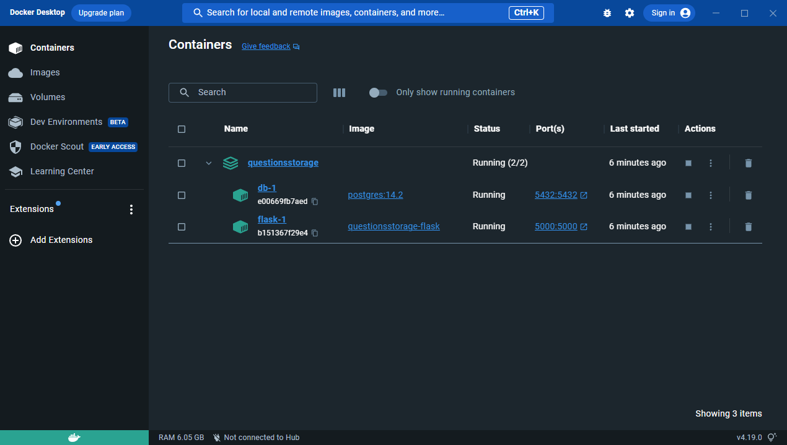
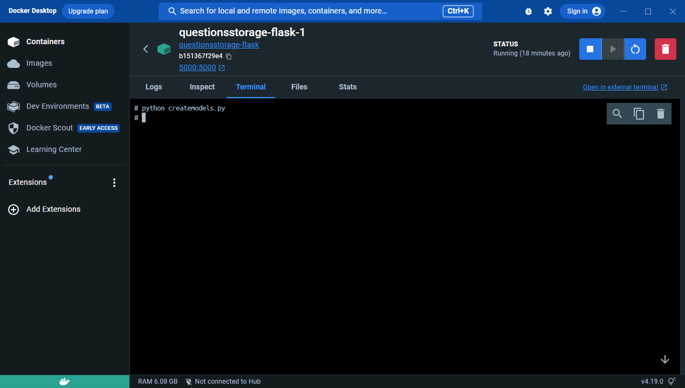
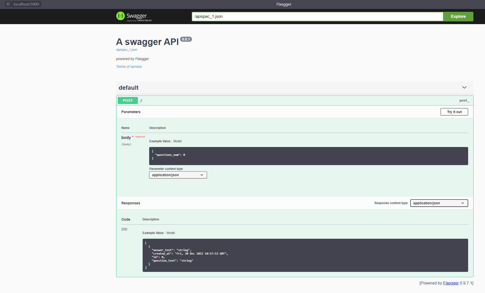

# Хранилище вопросов Тестовое задание №1 для Bewise.ai.

>Ссылка на второе задание: https://github.com/alxotsu/AudioConvertor.git

Приложение записывает в базу данных вопросы для викторины из открытого API - https://jservice.io и в ответ на запрос
выдаёт вопросы, записанные в БД до этого. Приложение имеет Swagger форму для отправки POST запросов.

## Инструкция по размещению
Для размещения проекта необходим Docker. 
В корне проекта создайте файл ".env", в файле нужно написать "DEBUG=1" или "DEBUG=0" для того, чтобы запустить
flask приложение в режими отладки или в боевом режими соответственно.

После этого в корне проекта нужно выполнить команду:

```
docker-compose up
```

После создания контейнеров по порту 5432 будет доступна СУБД PostgreSQL

>Пользователь: user
>
>Пароль: password
>
>Название БД: db

По порту 5000 доступен веб-сервис.



После установки и успешного запуска контейнеров нужно зайти в терминал контейнера "flask" и ввести команду:
```
python createmodels.py
```


Команда создаёт таблицу в БД для храния экземпляров вопросов. После выполнения команды настройка приложения завершена.

## Пример использования
По url http://localhost:5000/apidocs/ находится swagger. 



В качестве тел запросов могут быть использованы следующие примеры:

```
{
  "questions_num": 0
}


{
  "questions_num": 5
}


{
  "questions_num": 10
}
```

Ответ на первый запрос гарантированно вернёт пустой массив, при этом в БД будет загружено число вопросов, указанное в
параметре questions_num. Загруженные вопросы будут отданы в ответ на следующий запрос.

## Использованный стэк

- Flask
- Docker
- PostgreSQL
- SQLAlchemy
- flasgger
